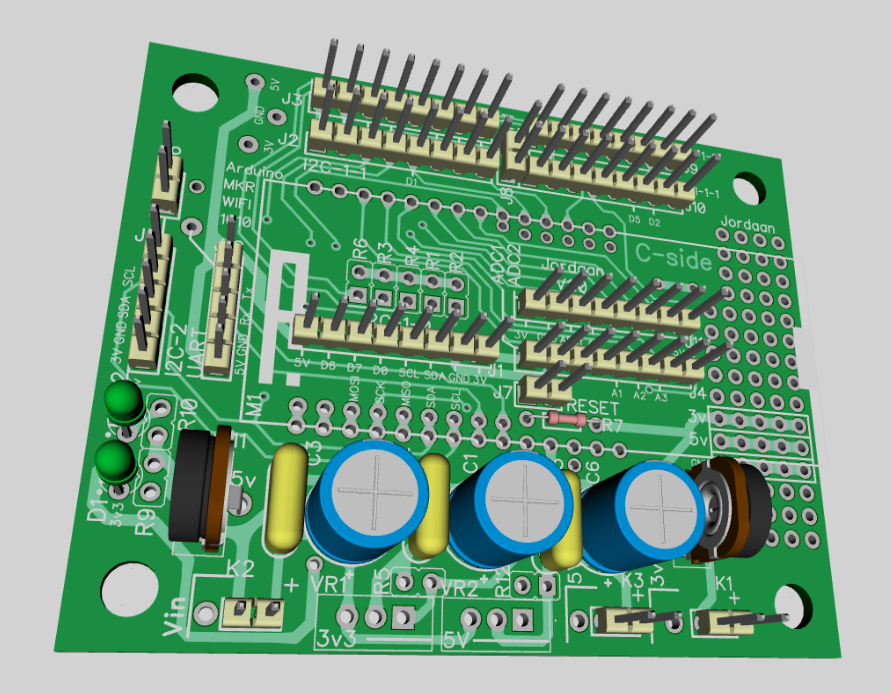

# MKR WiFi 1010 Shield

This board acts as a carrier for the Arduino MKR WiFi 1010 Micro-Controller.
https://docs.arduino.cc/hardware/mkr-wifi-1010/

The Printed Circuit Boards( PCBs) are designed using DipTrace.
A free DipTrace viewer is available to view the design files. https://diptrace.com/download/download-diptrace/

The goal is to have a fairly universal board for these micro-controllers that can be adapted to a variety of small projects.
The I2C and SPI interfaces should also align with the pinouts of other Micro-Controller shields I made - thus pheripherals can be used on either micro-controller shield.

#### Circuit Description
It consists of a Power Input with two adjustable voltage regulators to provide a 3V3 and 5V supply for use by the controller and pheripherals.

There 3 x I2C interfaces and 3 x SPI interfaces.
An ADC interface

With the ESP32 - IO pins can have a number of functions. Refer to the diagram for where these are connected and what could be done.

#### Assembly
The Micro-Controller is mounted on headers to make it easier for future replacements/repairs.
Almost all the components are mounted on the c-side including the Micro-Controller.
However most of the connectors for the SPI and I2C devices can be mounted on the other side - if that would be easier.
Refer to the Silkscreen text.

---

#### PCB Images

**3D View**

